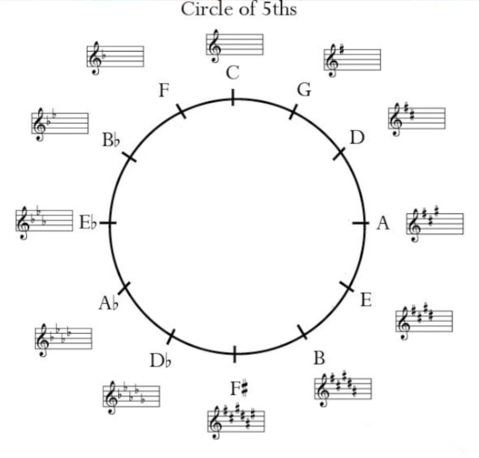
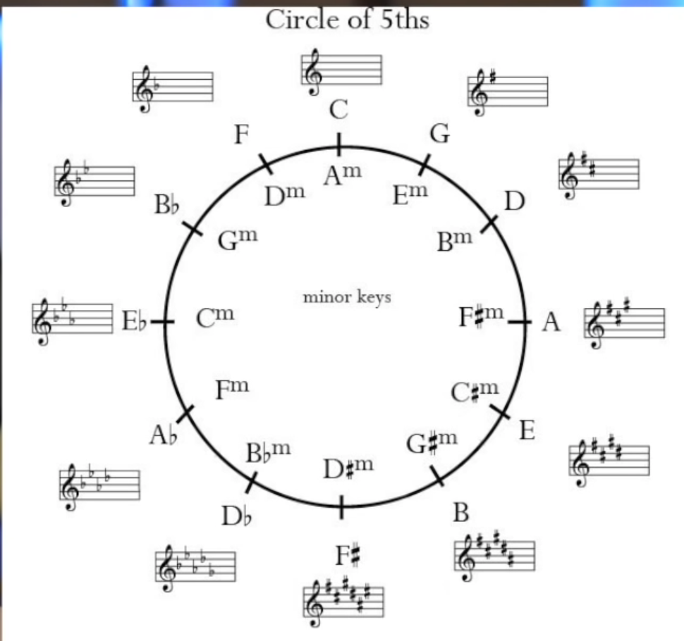

# Music Theory

- Scales
    - Major Scale
        - W W H   W W W H (W: whole step, H: Half step)
    - Minor Scale
        - W H W   W H W W
- Chords
    - Triad
        - C Major 

## Circle of 5ths

## References
- [Music Theory in 16 Minutes](https://www.youtube.com/watch?v=_eKTOMhpy2w)
- [How to read music - Tim Hansen](https://www.youtube.com/watch?v=ZN41d7Txcq0)
- [(A different way to visualize rhythm - John Varney](https://www.youtube.com/watch?v=2UphAzryVpY)
